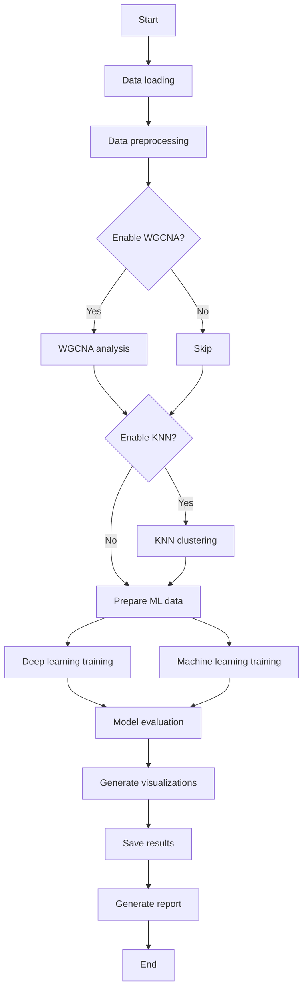

# Drone-embryogenesis_ML

Deep learning framework for gene-expression pattern analysis.

# Enhanced Gene Expression Analysis System V3.0

## Introduction

**Enhanced Gene Expression Analysis System V3.0** is an integrated gene-expression data analysis toolkit. It combines weighted gene co-expression network analysis, unsupervised clustering, machine learning, deep learning, visualization, and automated report generation. The system is designed for gene-expression pattern recognition, co-expression network construction, and biomarker or candidate-gene discovery.

### Key Features

- **WGCNA analysis**: weighted gene co-expression network analysis.
- **KNN clustering**: unsupervised clustering refinement based on local density.
- **Deep learning**: 11 neural-network models for expression-pattern classification.
- **Machine learning**: 8 classical machine-learning algorithms.
- **Visualization**: more than 30 publication-style scientific visualizations.
- **Report generation**: automated comprehensive HTML analysis reports.

---

## Main Functions

### 1. Network Analysis Module

#### WGCNA: Weighted Gene Co-expression Network Analysis

```python
# Core functions
- Automatic soft-threshold power selection
- Topological overlap matrix (TOM) calculation
- Hierarchical clustering and dynamic tree cutting
- Module detection and module merging
- Module eigengene extraction
```

**Key parameters**

- `--soft_power`: soft-thresholding power. Set to `0` for automatic detection.
- `--min_module_size`: minimum module size. Default: `30`.
- `--merge_cut_height`: module merging threshold. Default: `0.25`.
- `--network_type`: network type, including `unsigned`, `signed`, or `signed_hybrid`.
- `--deep_split`: dynamic tree-cutting depth, ranging from `0` to `3`.

#### KNN-based Unsupervised Clustering

```python
# Core functions
- Local density calculation
- Density-peak identification
- Cluster expansion
- Adaptive parameter selection
```

**Key parameters**

- `--n_neighbors`: number of nearest neighbors. Default: `10`.
- `--min_cluster_size`: minimum cluster size. Default: `5`.
- `--knn_method`: clustering method, including `standard` or `adaptive`.

---

### 2. Machine Learning Module

#### Deep Learning Models

| Model | Architecture feature | Suitable application |
|---|---|---|
| **RNN** | Basic recurrent neural network | Temporal-dependency modeling |
| **LSTM** | Long short-term memory network | Long-range dependency capture |
| **BiLSTM** | Bidirectional LSTM | Use of contextual information |
| **GRU** | Gated recurrent unit | Lightweight temporal modeling |
| **CNN** | One-dimensional convolutional network | Local pattern recognition |
| **ResNet** | Residual network | Deep feature learning |
| **Transformer** | Attention mechanism | Global dependency modeling |
| **AttentionRNN** | Attention plus RNN | Identification of informative positions |
| **TCN** | Temporal convolutional network | Causal sequence modeling |
| **WaveNet** | Gated convolutional network | Sequence modeling and generation |
| **InceptionTime** | Multi-scale convolution | Multi-resolution feature extraction |

#### Classical Machine Learning Models

| Model | Type | Feature |
|---|---|---|
| **Random Forest** | Ensemble learning | Robust performance and feature importance |
| **Gradient Boosting** | Ensemble learning | High accuracy through sequential optimization |
| **AdaBoost** | Ensemble learning | Adaptive sample weighting |
| **Extra Trees** | Ensemble learning | Highly randomized trees |
| **SVM** | Support vector machine | Suitable for high-dimensional data |
| **KNN** | Instance-based learning | Simple and intuitive |
| **Logistic Regression** | Linear model | Interpretable classification |
| **Naive Bayes** | Probabilistic model | Fast training |

---

### 3. Visualization Module

#### Network Visualization

- **Gene network plots**: Cytoscape-style interactive networks.
- **TOM heatmaps**: visualization of the topological overlap matrix.
- **Module dendrograms**: hierarchical clustering trees.
- **Eigengene correlation heatmaps**: relationships among modules.

#### Expression-pattern Visualization

- **Time-series plots**: colored trend lines with confidence intervals.
- **Heatmap analysis**: raw expression values, Z-scores, and hierarchical clustering views.
- **Boxplots**: group differences and significance testing.
- **Radar charts**: multidimensional model-performance comparison.

#### Model-performance Visualization

- **Neural-network architecture diagrams**: circular node-based architecture plots.
- **Confusion matrices**: detailed classification-performance summaries.
- **Learning curves**: training-process tracking.
- **Overfitting analysis**: comparison between training and testing performance.
- **Precision–recall trade-off plots**: relationship between precision and recall.

---

## System Architecture

```text
Enhanced Gene Expression Analysis System V3.0
│
├── Data preprocessing layer
│   ├── Data loading: automatic CSV/TSV delimiter detection
│   ├── Quality control: zero-expression, low-expression, and low-variance filtering
│   ├── Normalization: log2 transformation and Z-score scaling
│   └── Group integration
│
├── Network analysis layer
│   ├── WGCNA module
│   │   ├── Soft-threshold selection
│   │   ├── Adjacency matrix calculation
│   │   ├── TOM calculation
│   │   ├── Module detection
│   │   └── Eigengene extraction
│   │
│   └── KNN clustering module
│       ├── Density calculation
│       ├── Peak identification
│       └── Cluster expansion
│
├── Machine learning layer
│   ├── Deep learning engine: PyTorch
│   │   ├── Model construction
│   │   ├── Training optimization
│   │   ├── Early stopping
│   │   └── Model export
│   │
│   └── Classical machine learning: Scikit-learn
│       ├── Ensemble learning
│       ├── Support vector machines
│       └── Probabilistic models
│
├── Visualization layer
│   ├── Network plots: NetworkX and Matplotlib
│   ├── Statistical plots: Seaborn and Matplotlib
│   └── Interactive reports: HTML
│
└── Output management layer
    ├── Directory creation
    ├── Result saving: CSV, JSON, PNG, and PDF
    └── Report generation: HTML
```

---

## Installation

### System Requirements

```bash
# Python version
Python >= 3.7

# Operating systems
Windows / Linux / macOS
```

### Dependency Installation

#### Option 1: Install from `requirements.txt`

```bash
# Create a virtual environment. Recommended.
conda create -n gene_analysis python=3.9
conda activate gene_analysis

# Install dependencies
pip install -r requirements.txt
```

**requirements.txt**

```txt
numpy==1.24.3
pandas==2.0.3
torch==2.0.1
scikit-learn==1.3.0
scipy==1.11.1
matplotlib==3.7.2
seaborn==0.12.2
networkx==3.1
joblib==1.3.1
```

#### Option 2: Manual Installation

```bash
# Core packages
pip install numpy pandas scipy

# Machine learning
pip install torch scikit-learn

# Visualization
pip install matplotlib seaborn

# Other packages
pip install networkx joblib
```

### Optional Dependencies

```bash
# Improved Venn-diagram support
pip install matplotlib-venn

# GPU support: CUDA 11.8 example
pip install torch torchvision torchaudio --index-url https://download.pytorch.org/whl/cu118
```

### Installation Check

```bash
python gene_analysis.py --help
```

---

## Usage

### Basic Usage

```bash
python gene_analysis.py -i expression.csv -g groups.txt
```

### Complete Analysis: Recommended

```bash
python gene_analysis.py \
    -i expression.csv \
    -g groups.txt \
    --wgcna \
    --soft_power 6 \
    --min_module_size 30 \
    --knn \
    --n_neighbors 10 \
    --epochs 200 \
    --learning_rate 0.001 \
    --export_models
```

### Quick Test

```bash
# Test on a small dataset
python gene_analysis.py \
    -i small_dataset.csv \
    -g groups.txt \
    --epochs 50 \
    --test_size 0.3
```

### High-performance Configuration

```bash
# Multi-core parallelization and GPU acceleration
python gene_analysis.py \
    -i large_dataset.csv \
    -g groups.txt \
    --wgcna \
    --knn \
    --n_jobs -1 \
    --batch_size 64
```

---

## Input File Format

### 1. Expression Matrix: `expression.csv`

**Format requirements**

- Rows: genes.
- Columns: samples.
- First column: gene IDs.
- Values: expression levels, either raw counts or normalized values.

**Example**

```csv
Gene_ID,Sample1,Sample2,Sample3,Sample4
Gene_A,100.5,120.3,95.2,110.8
Gene_B,50.2,55.1,48.9,52.3
Gene_C,200.1,210.5,195.3,205.7
...
```

**Supported delimiters**

- Automatic detection: `,`, `;`, `\t`, or spaces.
- Manual specification: `--sep comma/tab/space`.

### 2. Group File: `groups.txt`

**Format requirements**

- Two columns: `Sample_ID` and `Group`.
- A header line is required.
- Sample IDs must match the sample names in the expression matrix.

**Example**

```txt
Sample_ID    Group
Sample1      T0
Sample2      T0
Sample3      T1
Sample4      T1
Sample5      T2
Sample6      T2
```

**Supported group labels**

- Time points: `T0`, `T1`, `T2`, ...
- Treatments: `Control`, `Treated`, ...
- Biological conditions: `WT`, `Mutant`, ...
- Any other text labels.

---

## Output Results

### Directory Structure

```text
analysis_results_20240101_120000/
│
├── wgcna_analysis/                       # WGCNA analysis results
│   ├── wgcna_soft_threshold.png          # Soft-threshold selection plot
│   ├── wgcna_gene_dendrogram.png         # Gene clustering dendrogram
│   ├── wgcna_tom_heatmap.png             # TOM heatmap
│   ├── module_statistics.png             # Module statistics
│   ├── module_eigengene_correlations.png # Eigengene correlation heatmap
│   ├── wgcna_modules.csv                 # Module assignment table
│   └── module_eigengenes.csv             # Module eigengene matrix
│
├── knn_clustering/                       # KNN clustering results
│   ├── knn_clustering.csv                # Clustering result table
│   └── integrated_clustering.csv         # Integrated clustering table
│
├── models/                               # Model-specific folders
│   ├── RNN/
│   │   ├── RNN_performance.png           # Performance plot
│   │   ├── RNN_predictions_with_expression.csv
│   │   └── RNN_summary.json
│   ├── LSTM/
│   ├── CNN/
│   └── ...                               # One folder for each model
│
├── neural_network_architectures/         # Neural-network architecture plots
│   ├── RNN_architecture_circular.png
│   ├── LSTM_architecture_circular.png
│   └── ...                               # All deep-learning models
│
├── overfitting_analysis/                 # Overfitting analysis
│   ├── RNN_overfitting_analysis.png
│   ├── LSTM_overfitting_analysis.png
│   └── ...
│
├── time_series_analysis/                 # Time-series analysis
│   └── time_series_analysis_enhanced.png
│
├── boxplot_analysis/                     # Boxplot analysis
│   ├── RNN_boxplot_analysis.png
│   ├── LSTM_boxplot_analysis.png
│   └── ...
│
├── heatmap_analysis/                     # Heatmap analysis
│   ├── RNN_heatmap_analysis.png
│   ├── LSTM_heatmap_analysis.png
│   └── ...
│
├── networks/                             # Gene networks
│   ├── gene_network.png                  # Main network
│   ├── gene_network.gml                  # Cytoscape-compatible format
│   ├── network_T0.png                    # Time-point-specific network
│   ├── network_T1.png
│   ├── network_genes_boxplot_significance.png
│   └── network_statistics.json
│
├── visualizations/                       # Integrated visualizations
│   ├── comprehensive_model_analysis.png  # Four-panel integrated analysis
│   ├── model_comparison_bars.png         # Model comparison
│   ├── model_radar_charts.png            # Radar charts
│   ├── precision_recall_tradeoff.png     # PR curve
│   ├── expression_pattern_analysis.png   # Expression-pattern analysis
│   ├── cluster_centers_heatmap.png       # Cluster-center heatmap
│   └── key_genes_patterns.png            # Key-gene patterns
│
├── intersection_analysis/                # Intersection analysis
│   ├── models_venn_diagram.png           # Venn diagram
│   ├── gene_overlap_analysis.png         # Overlap analysis
│   └── intersection_genes.csv            # Intersected gene list
│
├── data/                                 # Data files
│   ├── group_means.csv                   # Group means
│   ├── gene_clusters.csv                 # Gene clustering
│   ├── key_genes.csv                     # Key genes
│   ├── model_performance.csv             # Model performance table
│   ├── model_results.json                # Result JSON file
│   ├── preprocessing_stats.json          # Preprocessing statistics
│   ├── intersection_genes.csv            # Intersected genes
│   └── {Model}_predictions.csv           # Model-specific predictions
│
├── reports/                              # Report files
│   ├── comprehensive_analysis_report.html # Comprehensive HTML report
│   └── analysis_summary.json             # Summary JSON file
│
├── exported_models/                      # Exported models
│   ├── RNN/
│   │   └── RNN_model.pth
│   ├── LSTM/
│   │   └── LSTM_model.pth
│   ├── RandomForest/
│   │   └── RandomForest_model.joblib
│   └── ...
│
└── directory_structure.json              # Directory-structure index
```

### Key Output Files

#### 1. Module Assignment File: `wgcna_modules.csv`

```csv
Gene,Module
Gene_A,turquoise
Gene_B,blue
Gene_C,brown
...
```

#### 2. Model-performance Table: `model_performance.csv`

```csv
Model,Accuracy,Precision,Recall,F1,Training_Time
LSTM,0.9234,0.9156,0.9234,0.9189,45.23
CNN,0.9123,0.9045,0.9123,0.9078,32.15
...
```

#### 3. Key-gene List: `key_genes.csv`

```csv
gene,pattern,slope,r_squared,max_change,cv,score,cluster
Gene_X,Strong_Increasing,1.234,0.89,2.5,0.15,25.6,1
Gene_Y,Peak,0.345,0.76,3.2,0.22,18.9,2
...
```

#### 4. Prediction File: `predictions_with_expression.csv`

```csv
gene,true_label,predicted_label,correct,true_pattern,predicted_pattern,expr_Sample1,...
Gene_A,0,0,True,Increasing,Increasing,100.5,...
Gene_B,2,2,True,Peak,Peak,200.1,...
...
```

---

## Parameters

### Required Parameters

| Parameter | Type | Description |
|---|---|---|
| `-i, --input` | string | Path to the expression matrix |
| `-g, --groups` | string | Path to the group file |

### WGCNA Parameters

| Parameter | Type | Default | Description |
|---|---:|---:|---|
| `--wgcna` | flag | `False` | Enable WGCNA analysis |
| `--soft_power` | integer | `0` | Soft-thresholding power. `0` means automatic selection |
| `--min_module_size` | integer | `30` | Minimum module size |
| `--merge_cut_height` | float | `0.25` | Module merging threshold |
| `--network_type` | choice | `unsigned` | Network type |
| `--deep_split` | integer | `2` | Dynamic tree-cutting depth, from `0` to `3` |

### KNN Parameters

| Parameter | Type | Default | Description |
|---|---:|---:|---|
| `--knn` | flag | `False` | Enable KNN clustering |
| `--n_neighbors` | integer | `10` | Number of nearest neighbors |
| `--min_cluster_size` | integer | `5` | Minimum cluster size |
| `--knn_method` | choice | `standard` | Clustering method |

### Deep Learning Parameters

| Parameter | Type | Default | Description |
|---|---:|---:|---|
| `--epochs` | integer | `100` | Number of training epochs |
| `--learning_rate` | float | `0.001` | Learning rate |
| `--batch_size` | integer | `32` | Batch size |
| `--hidden_size` | integer | `64` | Hidden-layer size |
| `--dropout` | float | `0.3` | Dropout rate |
| `--num_layers` | integer | `2` | Number of RNN layers |
| `--patience` | integer | `20` | Early-stopping patience |

### Other Parameters

| Parameter | Type | Default | Description |
|---|---:|---:|---|
| `--test_size` | float | `0.2` | Test-set proportion |
| `--val_size` | float | `0.2` | Validation-set proportion |
| `--n_clusters` | integer | `6` | Number of K-means clusters |
| `--output_prefix` | string | `analysis` | Output prefix |
| `--export_models` | Boolean | `True` | Export trained models |
| `--n_jobs` | integer | `-1` | Number of parallel jobs |

---

## Analysis Workflow

### Complete Workflow



### Detailed Steps

#### Step 1: Data Loading and Preprocessing

1. **File reading**
   - Automatically detect delimiters.
   - Validate file format.
   - Load the expression matrix and group information.

2. **Quality control**
   - Remove zero-expression genes.
   - Filter low-expression genes, for example genes expressed above the threshold in fewer than three samples.
   - Filter low-variance genes, for example genes below the 10th variance percentile.

3. **Normalization**
   - Apply log2 transformation when needed.
   - Match samples between the expression matrix and the group file.
   - Calculate group means and standard deviations.

#### Step 2: WGCNA Analysis

1. **Soft-threshold selection**

   ```python
   # Automatically select the optimal power
   # Target: R² > 0.85
   # Range: 1–20
   ```

2. **Network construction**
   - Calculate the adjacency matrix.
   - Calculate the TOM matrix.
   - Perform hierarchical clustering.

3. **Module detection**
   - Apply dynamic tree cutting.
   - Merge similar modules.
   - Extract module eigengenes.

#### Step 3: KNN Clustering

1. **Density calculation**

   ```python
   density = 1 / (mean_knn_distance + epsilon)
   ```

2. **Peak identification**
   - Identify local density maxima.
   - Apply density-threshold filtering.

3. **Cluster expansion**
   - Expand clusters based on density reachability.
   - Consider the seed-density ratio.

#### Step 4: Machine Learning

1. **Data preparation**
   - Extract features, such as group means.
   - Generate labels for expression-pattern classification.
   - Split data into training, validation, and test sets.

2. **Deep learning training**
   - Train 11 neural-network models.
   - Apply early stopping.
   - Use learning-rate scheduling.
   - Validate each model.

3. **Classical machine learning**
   - Train 8 classical algorithms.
   - Perform cross-validation when enabled.
   - Conduct hyperparameter optimization when enabled.

#### Step 5: Evaluation and Visualization

1. **Performance evaluation**
   - Accuracy, precision, recall, and F1 score.
   - Confusion matrix.
   - Training time.

2. **Visualization**
   - More than 30 plot types.
   - PDF and PNG outputs.
   - High-resolution figures.

3. **Report generation**
   - Comprehensive HTML report.
   - JSON summary.
   - CSV result tables.

---

## Frequently Asked Questions

### Q1: What should I do if memory is insufficient?

**Problem:** Memory overflow occurs when analyzing large datasets.

**Solutions**

```bash
# 1. Increase virtual memory.
# 2. Process data in batches.
# 3. Increase the minimum module size.
python gene_analysis.py \
    -i large_data.csv \
    -g groups.txt \
    --min_module_size 50 \
    --batch_size 16
```

### Q2: What if WGCNA cannot find a suitable soft-threshold power?

**Problem:** The scale-free topology fit index remains below 0.85.

**Solutions**

```bash
# 1. Manually specify the power
--soft_power 12

# 2. Lower the R² threshold in the code by modifying RsquaredCut

# 3. Use a signed network
--network_type signed
```

### Q3: What if model training is too slow?

**Solutions**

```bash
# 1. Reduce the number of epochs
--epochs 50

# 2. Use GPU acceleration
# GPU will be detected automatically when available

# 3. Reduce the number of models
# Comment out unnecessary models in the code

# 4. Use parallel computing
--n_jobs -1
```

### Q4: What if no matching samples are found?

**Problem:** The program reports `No matching samples between expression data and group file`.

**Solutions**

```bash
# 1. Check sample-name formatting.
# Sample names in the expression matrix must exactly match Sample_ID in the group file.

# 2. Remove spaces.
sed 's/ //g' groups.txt > groups_clean.txt

# 3. Make the letter case consistent.
```

### Q5: What if Chinese characters are not displayed correctly in figures?

**Solution**

```python
# Add the following lines at the beginning of the code:
import matplotlib.pyplot as plt
plt.rcParams['font.sans-serif'] = ['SimHei']          # Windows
plt.rcParams['font.sans-serif'] = ['Arial Unicode MS'] # macOS
```

### Q6: What if GPU is not being used?

**Check**

```python
import torch
print(torch.cuda.is_available())      # Expected output: True
print(torch.cuda.get_device_name(0))  # Display GPU name
```

**Install CUDA-enabled PyTorch**

```bash
# CUDA 11.8
pip install torch --index-url https://download.pytorch.org/whl/cu118

# CUDA 12.1
pip install torch --index-url https://download.pytorch.org/whl/cu121
```

---

## Advanced Usage

### 1. Custom Model

```python
# Add a new model to the code
class CustomModel(nn.Module):
    def __init__(self, input_size, num_classes=4):
        super(CustomModel, self).__init__()
        self.fc1 = nn.Linear(input_size, 128)
        self.fc2 = nn.Linear(128, num_classes)

    def forward(self, x):
        x = torch.relu(self.fc1(x))
        return self.fc2(x)

# Add it to the model dictionary
dl_models['Custom'] = CustomModel(input_size=n_features)
```

### 2. Batch Analysis

```bash
#!/bin/bash
# batch_analysis.sh

for dataset in data/*.csv; do
    python gene_analysis.py \
        -i "$dataset" \
        -g "${dataset%.csv}_groups.txt" \
        --wgcna --knn \
        --output_prefix "$(basename $dataset .csv)"
done
```

### 3. Parameter Grid Search

```python
# Enable grid search by passing the argument below:
--grid_search

# Define a parameter grid in the code:
param_grid = {
    'n_estimators': [50, 100, 200],
    'max_depth': [5, 10, 15],
    'min_samples_split': [2, 5, 10]
}
```

---

## Performance Optimization

### Hardware Recommendations

| Component | Minimum | Recommended | Large-data configuration |
|---|---:|---:|---:|
| CPU | 4 cores | 8 cores | 16+ cores |
| RAM | 8 GB | 16 GB | 32 GB or more |
| GPU | Not required | GTX 1060 | RTX 3090 |
| Storage | HDD | SSD | NVMe SSD |

### Dataset-size Guide

| Number of genes | Number of samples | Estimated runtime | Recommended configuration |
|---:|---:|---:|---|
| < 5,000 | < 50 | 10–30 min | Minimum |
| 5,000–10,000 | 50–100 | 30 min–2 h | Recommended |
| 10,000–20,000 | 100–200 | 2–6 h | Large-data configuration |
| > 20,000 | > 200 | > 6 h | Server configuration |

---

## Notes

This README describes the overall functions, input requirements, output structure, and recommended usage of the Enhanced Gene Expression Analysis System V3.0. Before formal publication or repository release, please check that all command-line arguments listed here are consistent with the final version of `gene_analysis.py`.
